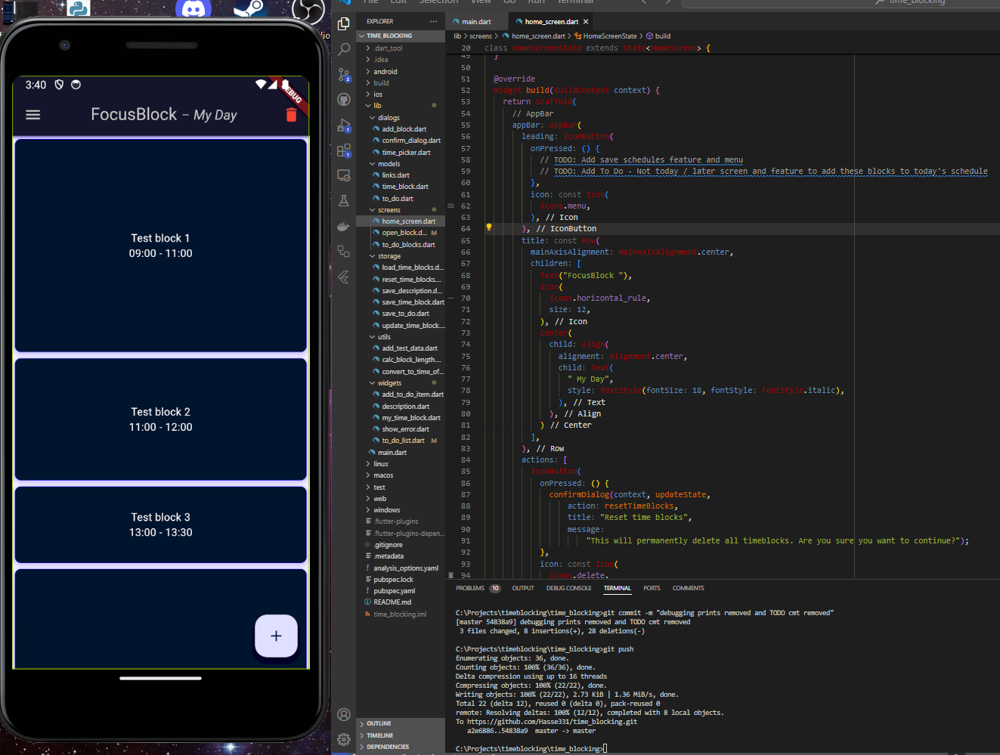
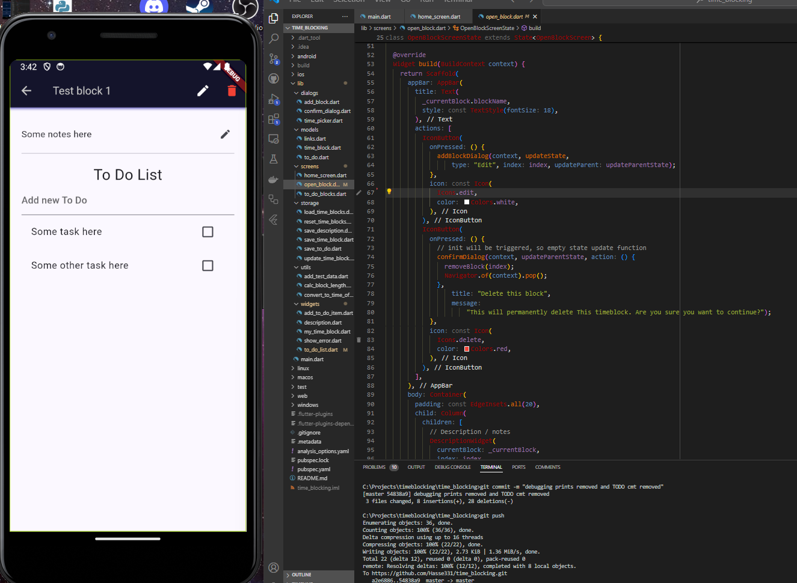

# FocusBlock™ - Time management application
I did not find a good and simple time-blocking app in the Google Play Store or elsewhere, so I decided to make my own, which is minimalistic and simple enough. I personally don't like that mobile applications become distractions instead of tools to improve productivity, and this is the problem I try to fix with this project.

The goal is to make first base features and maintainable code structure, then optimize the application as a comprehensive cross-platform application with firebase/supabase backend with real-time data synchronizing. The full version of the application with cloud synchronizing and cross-platform features could be then monetized based on a monthly SaaS subscription.

# Feature list

 - Adding blocks with name, block start and end time
 - Adding notes, todo lists, links and (soon) notification for each block
 - Saving and loading blocks as To Do blocks
 - Saving and loading templates

# Technical specification / tech stack

 - Dart
 - Flutter
 - Shared preferences library for saving the data locally in JSON
  

Test the live version of the application by:
 [Visiting the web version (UI not fully optimized)](https://focusblock-ten.vercel.app)
 
 or
 
 By installing the android APK from here:
 [Google drive link](https://drive.google.com/file/d/1WfeBbSTWtmMny2mFNNkr_BwZzN3tUFQm/view?usp=drive_link)

[View my current wakatime worktime for this project](https://wakatime.com/@018ea958-8683-4c8d-8e87-711366038480/projects/irlhtphant?start=2024-08-27&end=2024-09-02)

[View my FocusBlock coding reults here](results.md)

